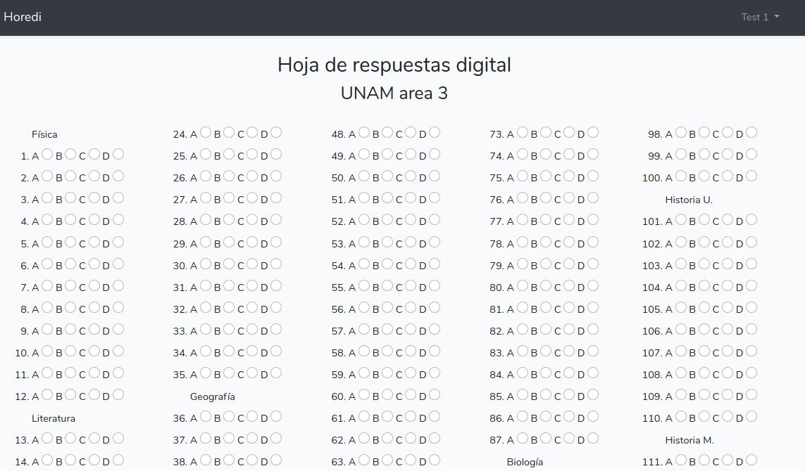

# Horedi

```shell
Diciembre, 2019
email : rhodfra@gmail.com
Laravel Framework 6.7.0 | PHP 7.3.11 (cli) (built: Oct 23 2019 16:31:28) ( NTS ) | Laravel Installer 2.1.0
```

<p align="center"></p>
<p align="center">
<a href="https://travis-ci.org/laravel/framework"></a>
<a href="https://packagist.org/packages/laravel/framework"></a>
</p>

## Hoja de Respuestas Digitales

Horedi es un sistema que califica exámenes y devuelve el resultado a través de gráficas. La calificación del estudiante se guarda en una base de datos. 

Las opciones del alumno se califican como A, B, C o D. No existe interacción de la pregunta y la respuesta del usuario, simplemente se llena el siguiente "formulario".



## Installation

Asegurarse de tener todo lo necesario para trabajar con laravel

* php (para el caso de Horedi, php >= 7.2)
* composer
* npm

Para usar la plantilla se deberán seguir los siguientes pasos:

1. Descargar el repositorio.

   Se puede usar git

   ```shell
   git clone https://github.com/rhofp/horedi.git
   ```

   O directamente se puede descargar el archivo comprimido en formato zip.

2. Descargar las dependencias de php del proyecto.

   ```shell
   composer install
   ```

3. Descargar las dependencias de javascript del proyecto.

   ```shell
   npm install && npm run dev
   ```

4. Crear una llave del proyecto.

   ```shell
   php artisan generate:key
   ```

5. Configurar una la conexión con una base de datos.

   Se puede configurar cualquier base de datos soportada por Laravel, como ejemplo sencillo se presenta la conexión con `sqlite`

   Generar un archivo en blanco llamado `database.sqlite` en la carpeta database

   ```shell
   touch database/database.sqlite
   ```

   Configurar el archivo `.env`

6. Generar las migraciones del proyecto.

   ```shell
   php artisan migrate
   ```

## Usage 

```shell
php artisan serve
```

## Contributing

Todas las contribuciones al proyecto son bienvenidas, se recomienda revisar el archivo correspondiente [CONTRIBUTING](CONTRIBUTING.md).

## License

El proyecto no cuenta con una licencia definida por ahora (No license).

## Credits

Ninguno, por ahora.